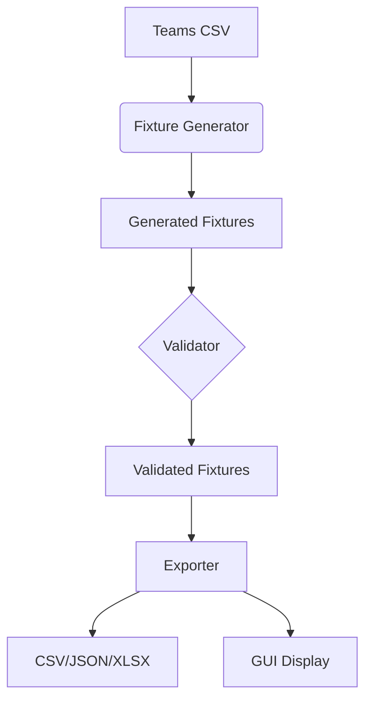

# fixture-generator (Double round-robin scheduling)
Modular Python program to generate fixtures for the ABC Premier League based on the given requirements. 

## **1. Project Overview**  
A Python-based application that automatically generates football fixtures for 10 teams in the ABC Premier League, adhering to league-specific constraints.  

**Key Features   :  
✅ Double round-robin scheduling (home/away matches)  
✅ Town-based match prioritization  
✅ Weekend capacity management (max 2 matches/weekend)  
✅ Multi-format export (CSV/JSON/Excel)  
✅ Validation for fairness and rule compliance  

---

##    .2. System Architecture   .  


---

##    .3. Key Components   .  

### **3.1 Fixture Generator**  
- **Input**: `teams.csv` (Team, Town, Stadium)  
- **Logic**:  
  - Creates home/away pairs for all teams  
  - Prioritizes inter-town matches first  
  - Enforces 2-match-per-weekend limit  
- **Output**: Structured fixture list  

### **3.2 Validator**  
Checks for:  
- Each team pair plays exactly twice (1 home, 1 away)  
- Town Rule compliance (local derbies scheduled last)  
- Weekend team limits (max 4 teams/weekend)  

### **3.3 Exporter**  
Generates files in:  
- CSV (for spreadsheets)  
- JSON (for APIs/web apps)  
- Excel (for manual editing)  

### **3.4 GUI Application**  
Built with Tkinter:  
- Fixture generation button  
- Interactive fixture table  
- Export options  
- Status notifications  

---

## **4. Usage Guide**  

### **4.1 Installation**  
```bash
pip install pandas openpyxl
```

### **4.2 Running the Application**  
1. Place `teams.csv` in `/data` folder  
2. Run:  
```bash
python main.py
```

### **4.3 Sample Workflow**  
1. Click "Generate Fixtures"  
2. Review fixtures in the table  
3. Export to preferred format  

---

## **5. Business Rules Implemented**  

| Rule | Implementation |  
|-------|---------------|  
| Double Round-Robin | Each team plays others twice |  
| Town Rule | Local derbies scheduled after inter-town matches |  
| Weekend Limit | Max 2 matches (4 teams) per weekend |  
| Stadium Assignment | Home team's stadium used |  


